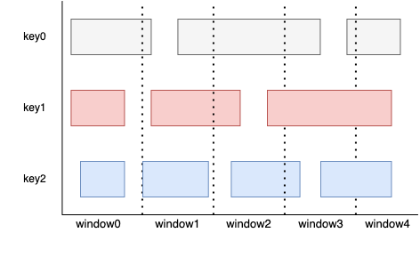
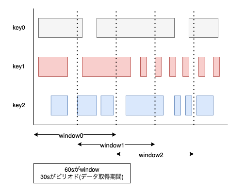
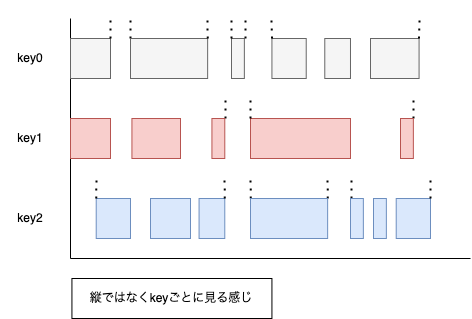

# Cloud Dataflow

# 概要

- `Apache Beam`をベースとしたバッチ処理/ストリーミング処理を得意としたフルマネージドサービス

# 詳細
- パイプラインで扱うデータの総称は**PCollection**という名で保存され、変換などの処理が行われた後でもPCollectionという。(不変だからこそパイプライン処理が高速になっている)

- その他処理関数としては以下の通りである
  - `ParDo`: 並列に処理変換を行う
  - `GroupByKey`: キー/バリューのPCollectionに対して、同じキーを持つ値を収集して一意のキーと全ての値のPCollectionにする
  - `CoGorupByKey`: 同じキータイプを持つ2つ以上のキー/バリューの結合を行う
  - `Combine`: データ内の要素または値のコレクションを組み合わせる
  - `Flatten`: 同じデータ型を格納する
  - `Partition`: 同じデータ型を格納するがパーティションによって1つのPCollectionを小さい塊に分けることができる

- Dataflowパイプラインをアップデートしながらメッセージを実行するにはドレイン機能
  - データを損失したくない場合も有効な手段
  - コスト節約優先でデータが消えても良い場合はキャンセル

- 「`--maxNumWorkers`」を指定することで<u>ジョブ処理に使用されるオートスケーリング範囲を制限できる</u>
  - バッチジョブはオプションで、デフォルト値は1000
  - Streaming Engineがありの場合: オプションは任意で、デフォルト値は100
  - Streaming Engineがなしの場合: オプションは必須

- `Apache Beam`のコードを利用して、リファレンスデータをデータパイプラインに渡す
副入力パターンがある

- トリガー: 集計結果をいつ出力するかを決めるもの
  - 作成はApache Beam SDKで行うことができる(Dataflowではできない)
    - トリガーの種類としては
      - 要素数
      - タイムスタンプ
      - 他トリガーの組み合わせ

- Hadoop/Sparkクラスターの移行先としてはDataprocが最初に検討されるが新しく作成する場合はDataflowも有効

- バッチデータとストリーミングデータを扱うことができる。しかし、ストリーミングの方は合計の計算を行うタイミングが不明である。

-> 期間または<u>ウィンドウ</u>を用いてその範囲内で計算を行う

## ウィンドウの種類

### 固定(Fixed)

- タイムスライスに分割されるウィンドウ
  - (例)
    - 時間単位(日、月、時間など)

- ウィンドウがそれぞれ同じ長さで作成されて、重なることはない

- イメージ図

- 使い道

  - WEBサイトのイベント発生時刻に基づいた1時間ごとの集計

  - 全部でユーザーが何人来たか

### スライディング(sliding)

- 一定の時間間隔をもつウィンドウ
  - (例)
    - 5分間データを受け取り、30分ごとに計算

- ウィンドウが<u>重なることがある</u>

- イメージ図

- 使い道

  - 移動平均を求めたい時

  - WEBサイトで10分ごとに1時間ごとの平均人数を集計する時

  - 集計結果から移動平均人数を算出したい時

    ※ キーワードは「**移動平均**」

### セッション(Session)

- 時間だけでなく、KEY単位でトラッキングしたい時に使用する

- 配信間隔が不規則なデータに役立つ

- 最小ギャップ時間以降は別のウィンドウとして処理される

- イメージ図

- 使い道

  - WEBページごとのアクセス数を各ユーザーごとに集計したい時(※固定ウィンドウではユーザ単位の集計は不可)

  - WEBサイトで1時間、ユーザーのインタラクションがない時(=最小ギャップ時間が60分)に対象のユーザーにPUSH通知を出したい時

  - モバイルゲームなどでプレイヤーごとの遅延に対処する必要がある時

- ウォーターマーク: ウィンドウの全てのデータが必要となる閾値
  - 新しく受信したデータのタイムスタンプがウォーターマークよりも古い場合、遅延データとみなす

## API&権限周り

### ジョブ実行に必要なAPI
- Compute Engine API
- Cloud Logging API
- Cloud Storage
- Cloud Storage JSON API
- BigQuery API
- Pub/Sub
- DataStore API

### ジョブの作成及びキャンセルする権限
- `DataflowDeveloperIAM`
- +α 他のGCloudIAM権限がないと処理しているデータを見ることはできない
- Dataflowワーカーのワークユニットを実行するためには`DataflowWorker`