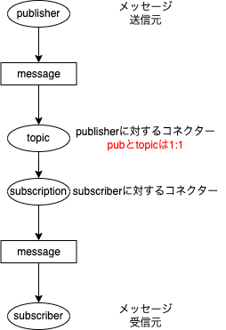
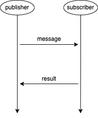
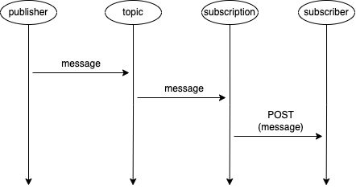

# Cloud Dataflow

# 概要
- 非同期メッセージングサービス
- フルマネージドサービス

# 詳細
- 確認応答期限が切れる前に確認応答がないと、メッセージが再送信される  
-> 重複の原因になる

- Apache Kafka(分散データストリーミングプラットフォーム)をストリーミングするPub/Sub Kafkaコネクタ

- +α: Pub/Sub Topic to BigQueryテンプレート -> JSON形式メッセージをBigQueryテーブルに書き込む

- 最大メッセージサイズは10MB、指数関数的に拡張することができる(スケールアウト)
  - Apache Kafkaとの差別点

- メッセージ保持期間は**10分〜7日**まで保持することができる
  - デフォルトは最長の7日間となっている
  - ちなみにApache Kafkaは1年間とかに設定できる

- num_outstanding_message: 未処理のメッセージがどれくらいあるか

- KafkaコネクターはPub/Subをシンクコネクター(データのレシーバー)として構成する

- 未配信メッセージが多くなる原因
  - サブスクライバーがメッセージをプルされた時にacknowledgeしていない
  - サブスクライバーが受け取るメッセージレートを満たせていない

- 転送順序は保証されていない(Datastoreと連携することを推奨)
  - +α: Apache Kafkaは保証されている

## 非同期メッセージと同期メッセージのイメージ図

- 非同期: pubはsubの状態・存在に関係なく送信する(eメールっぽい)

<section style="text-align: center;">

</section>

- 同期: pub・subともにactiveでやり取りを行う(電話っぽい)

<section style="text-align: center;">

</section>

## subscriptionからsubscriberへのメッセージ伝達方法

- Push方式: subscriptionから見てPushを行う

  - Pull方式に比べて遅延が少なめ

<section style="text-align: center;">

</section>

- Pull方式: subscriberから見てPullを行う

<section style="text-align: center;">

</section>